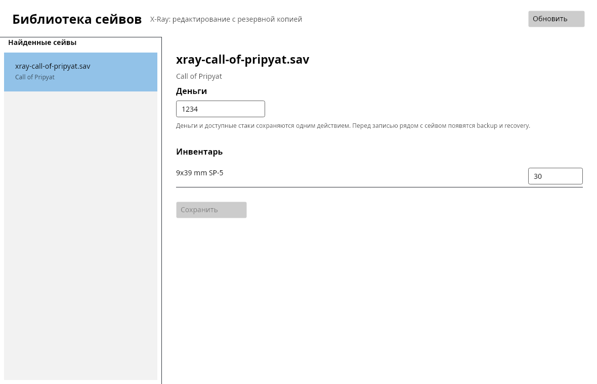

# S.T.A.L.K.E.R. Save Editor — Next (C#)

[](https://github.com/Dmitriy-DE/S.T.A.L.K.E.R.-Save_Editor/actions/workflows/companion-check.yml)
[](https://github.com/Dmitriy-DE/S.T.A.L.K.E.R.-Save_Editor/actions/workflows/ci.yml)

High-performance, cross-platform .NET 10 desktop editor and in-game companion for the **S.T.A.L.K.E.R.** series: *Shadow of Chernobyl*, *Clear Sky*, *Call of Pripyat*, their *Enhanced Editions*, and *S.T.A.L.K.E.R. 2: Heart of Chornobyl*.



---

## Key Features

### 🖥️ B1: Desktop UI Screen Parity & Theme
- **S.T.A.L.K.E.R. Industrial Theme**: Authentic Zone aesthetic with amber gauges, dark brushed metal panels, high-contrast monospace counters, and custom vector icons.
- **Full Screen Coverage**: Complete parity with the reference UI — Overview, Inventory, Stashes, Factions, Level Transitions, Backups, Settings, and Companion.
- **Draft Store & Undo/Redo**: Non-destructive editing buffer with multi-step Undo (`Ctrl+Z`) and Redo (`Ctrl+Y`).
- **Safety Guards**: Unknown, unverified, or ambiguous fields (and all S.T.A.L.K.E.R. 2 items until a verified writer is available) remain strictly read-only.
- **Centralized Writer Dispatch**: UI does not duplicate mutation logic or writer selection; all save writing delegates directly to Core (`XRayEditWriter`).

### 🔊 B2: Interactive Game Sound System
- **Authentic Zone Audio**: Interface sounds for button clicks, tab switching, item hovering, file opening, save confirmation, and error alerts.
- **Native Cross-Platform Playback**: Zero external runtime audio dependencies — utilizes WinMM `PlaySound` on Windows, `pw-play` / `paplay` / `aplay` on Linux, and `afplay` on macOS.
- **Preferences**: Volume slider, sound mute toggle, and instant preview in Settings.

### 🛡️ B3: Save Safety & Local Backup Management
- **Automatic Pre-Save Backups**: Every write creates a timestamped, SHA-256 verified backup copy in the user application data directory.
- **Visual Draft Journal**: Inspect pending changes before committing them to disk.
- **One-Click Rollback**: Easily restore any prior backup or recovery copy.

### 📡 B4 & G6: In-Game Companion Mod
- **Live Communication**: Command and query a running game engine without exiting or reloading saves.
- **Extended Protocol (v1)**: Instant healing, repair equipped gear, modify money, spawn items, teleport within level, weather manipulation, mark custom locations (`mark`), jump to last position (`jump_last`), and trigger engine saves (`quicksave`).
- **Universal Engine Support**: Single Lua 5.1 script compatible with SoC (1.0004/1.0006), CS (1.5.10), CoP (1.6.02), and Enhanced Editions.
- **Polite Engine Polling**: 2000 ms idle polling; accelerates to 250 ms only when in-game hotkeys are actively enabled.
- **Engine Safety**: Guarded CS weather FX (`level.stop_weather_fx`), time factor preservation across rewinds, story NPC protection in cleanup routines.
- **Customizable In-Game Hotkeys**: Does not conflict with vanilla game F-keys; defaults to `Ctrl+H` (heal), `Ctrl+R` (repair), `Ctrl+M` (money), `Ctrl+J` (jump), `Ctrl+S` (quicksave).

### ☁️ B5: Steam Cloud Synchronization
- **Isolated Steam Worker**: Out-of-process Steam RemoteStorage integration with a strict 15-second safety timeout.
- **Safe Read/List Operations**: Inspect and import cloud saves safely without automatic retries on uncertain writes.

### 🌐 B7: 15-Language Localization Engine
- **Supported Languages**: English (`en`), Russian (`ru`), Ukrainian (`uk`), Polish (`pl`), German (`de`), French (`fr`), Spanish (`es`), Italian (`it`), Czech (`cs`), Brazilian Portuguese (`pt-BR`), Turkish (`tr`), Japanese (`ja`), Simplified Chinese (`zh-Hans`), Hungarian (`hu`), and Romanian (`ro`).
- **Robust Fallback Chain**: `target -> ru -> en` guarantees text is never missing.
- **Completeness Tested**: 1,327 catalog strings per language with automated CI verification checking 100% string coverage and 0 placeholder mismatches.

### 📦 D1–D5: Cross-Platform Packaging & Distribution
- **Linux**: Debian package (`.deb`) and standalone portable `AppImage` using pinned `appimagetool v1.9.1` with `--appimage-extract-and-run`.
- **Windows**: Single-file portable `.exe` (with explicit `NoWarn="IL3000"` for SteamWorker runner) and Inno Setup 6 installer.
- **macOS**: Application bundle (`.app`) and Apple Disk Image (`.dmg`).
- **Automated Releases**: GitHub Actions pipeline compiles and publishes release packages on git version tags.

---

## Project Structure

```
├── src/
│   ├── StalkerSaveEditor.Core/       # X-Ray & S2 save parsers, serializers, archives
│   ├── StalkerSaveEditor.Desktop/    # Avalonia UI desktop application (Views, ViewModels, Theme, Audio, i18n)
│   ├── StalkerSaveEditor.Cli/        # Headless command-line tool & batch inspector
│   ├── StalkerSaveEditor.Steam/      # Steam RemoteStorage worker client
│   └── StalkerSaveEditor.Updater/    # Application update checker
├── mods/
│   └── companion/                    # In-game Lua companion mod (SoC, CS, CoP, EE, S2)
├── packaging/
│   ├── linux/                        # .deb & AppImage packaging scripts
│   ├── windows/                      # Inno Setup installer & build scripts
│   └── macos/                        # .app bundle & .dmg packaging scripts
├── tools/                            # Codecs, companion checkers, fixture generators
└── docs/                             # Architecture specs, parity docs, format scopes
```

---

## Building & Testing

### Prerequisites

- [.NET 10.0 SDK](https://dotnet.microsoft.com/)
- Python 3.12 (for codec compilation and tools)
- Lua 5.1 compiler (`luac5.1` or `luac`) for companion verification

### Build the Solution

```bash
dotnet restore StalkerSaveEditor.sln
dotnet build StalkerSaveEditor.sln --configuration Release
```

### Run Tests

```bash
# Run unit and integration tests
dotnet test StalkerSaveEditor.sln --configuration Release

# Check companion mod Lua syntax and hooks
./tools/check_companion.sh
```

### Run the Desktop Editor

```bash
dotnet run --project src/StalkerSaveEditor.Desktop/StalkerSaveEditor.Desktop.csproj
```

### Run Headless Screenshot / Selftest

```bash
dotnet run --project src/StalkerSaveEditor.Desktop/StalkerSaveEditor.Desktop.csproj -- \
  --screenshot artifacts/ui/preview.png \
  --fixture tests/Fixtures/xray-call-of-pripyat.sav
```

---

## Documentation Links

- [Project Roadmap & State](docs/roadmap/STATE.md)
- [Reliability & Verification Levels (L1–L5)](docs/roadmap/RL-reliability.md)
- [In-Game Companion Mod & Protocol Guide](docs/COMPANION.md)
- [Cross-Platform Packaging & Distribution](docs/PACKAGING.md)
- [Companion Protocol Specification (v1)](docs/MOD_COMPANION_PROTOCOL.md)
- [X-Ray Trilogy Reader Scope](docs/CS4_XRAY_TRILOGY.md)
- [S.T.A.L.K.E.R. 2 Reader Scope](docs/CS4_STALKER2.md)
- [Local Save Editing & Recovery Flow](docs/CS6_LOCAL_EDITING.md)
- [Architecture Guidelines](ARCHITECTURE.md)
- [Agent Boundaries & Safety Rules](AGENTS.md)
