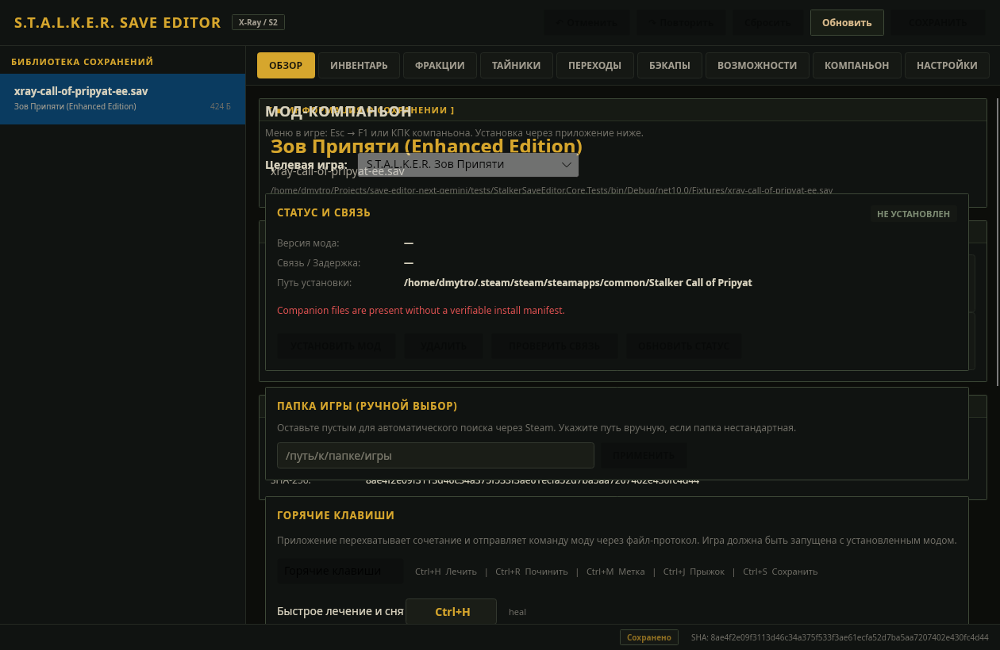
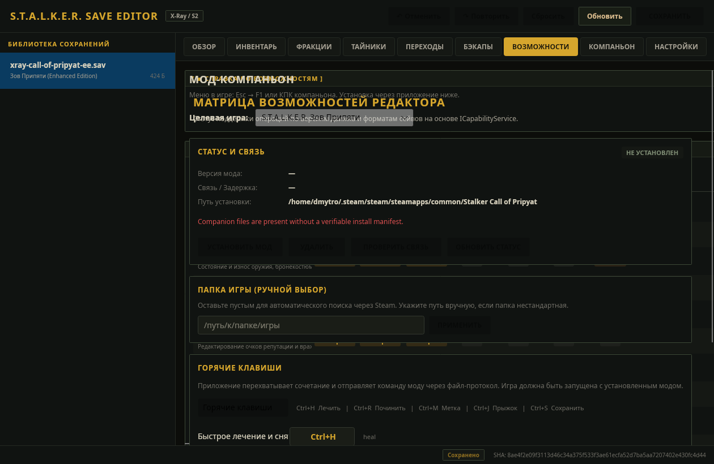
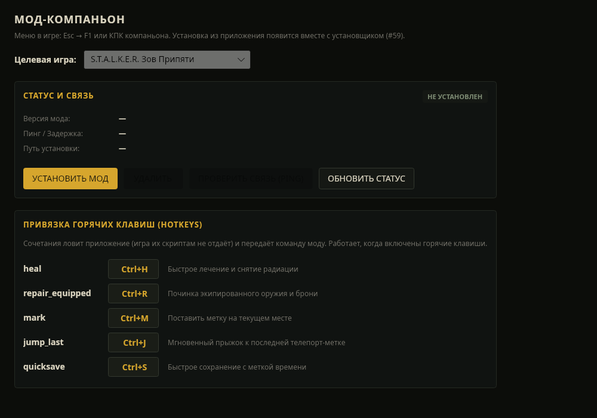

# S.T.A.L.K.E.R. Save Editor — Next (C#)

[](https://github.com/Dmitriy-DE/S.T.A.L.K.E.R.-Save_Editor/actions/workflows/companion-check.yml)
[](https://github.com/Dmitriy-DE/S.T.A.L.K.E.R.-Save_Editor/actions/workflows/ci.yml)

High-performance, cross-platform **.NET 10** desktop save editor and live in-game companion for the entire **S.T.A.L.K.E.R.** series:
- **S.T.A.L.K.E.R.: Shadow of Chernobyl** (1.0004 / 1.0006)
- **S.T.A.L.K.E.R.: Clear Sky** (1.5.10)
- **S.T.A.L.K.E.R.: Call of Pripyat** (1.6.02)
- **Enhanced Editions** (SoC, CS, CoP)
- **S.T.A.L.K.E.R. 2: Heart of Chornobyl** (UE5)



---

## What It Can Do

### 1. 🗃️ Complete Save Editing & Inspection
- **Overview Screen**: Inspect player health, radiation, psy-health, stamina, game coordinates (X, Y, Z), game time, and monetary balance.
- **Inventory Editor**:
  - View and modify item count, weight, and condition/durability (0–100%).
  - Inspect weapon and armor upgrade flags.
  - Inspect equipment placement (belt, backpack, weapon slots).
  - Add and delete inventory items through the centralized Core `EditService` API.
  - Non-destructive **Draft Store** with multi-step **Undo** (`Ctrl+Z`) and **Redo** (`Ctrl+Y`).
- **Stashes**: Discover and manage hidden stashes across the Zone.
- **Factions & Relations**: View and tune community goodwill and player reputation.
- **Level Transitions**: Inspect level changers and map transitions directly from X-Ray saves (`LevelChangers` reader).
- **Safety First**: Ambiguous fields stay read-only. S2 save modifications remain locked until verified writers land. Writes always create verified SHA-256 pre-save backups outside the save folder.



### 2. 🎮 Authentic Trilogy Industrial Theme & Zone Audio
- **Zone Aesthetic**: Authentic industrial framing, sharp corners (`CornerRadius = 1`), military bracket headers (`[ ▪ TITLE ]`), and X-Ray button hover/press states (`_e`, `_h`, `_t`).
- **Interactive Audio**: Authentic sound effects for button clicks, tab transitions, file loading, and save confirmations. Native cross-platform audio engines:
  - **Linux**: PulseAudio (`paplay`), PipeWire (`pw-play`), ALSA (`aplay`).
  - **Windows**: WinMM `PlaySound`.
  - **macOS**: `afplay`.

### 3. ☁️ Steam Cloud & Achievements
- **Steam RemoteStorage & S2 Auto-Cloud**: View local vs. cloud saves, compare timestamps, and download/synchronize saves.
- **Strict Write Safety**: Cloud writes require explicit user confirmation. Uncertain writes are marked in red with diagnostic explanations and are never automatically retried.
- **Achievements Manager**: Inspect unlocked Steam achievements with timestamps, view lock/unlock statuses, and toggle achievements with safeguard confirmations against lockout.

### 4. ⚙️ Settings & First-Launch Auto-Discovery
- **Smart Path Auto-Discovery**: Automatically searches and detects save directories for all 4 games across Windows and Linux (native Steam, GOG, and Linux Steam Proton wine prefixes: AppIDs 4500, 20510, 41700, 1643320).
- **First-Launch Wizard**: Automatically guides new users to locate or configure save directories on clean installs.
- **14-Language Localization**: English, Russian, Ukrainian, Polish, German, French, Spanish, Italian, Czech, Brazilian Portuguese, Turkish, Japanese, Simplified Chinese, and Traditional Chinese. Fully verified with zero missing keys.

### 5. 📡 In-Game Companion Mod
- **Live In-Game Bridge**: Issue commands to a running X-Ray engine without reloading your save (`ping`, `heal`, `repair_equipped`, `give`, `money`, `teleport`, `mark`, `jump_last`, `quicksave`, `weather`).
- **Safe Hotkeys**: Global non-conflicting hotkeys (`Ctrl+H`, `Ctrl+R`, `Ctrl+M`, `Ctrl+J`, `Ctrl+S`).
- **Automated Hook Manager**: Detects, installs, and uninstalls companion hooks in `bind_stalker.script` with automatic backup creation.



---

## How to Install & Run

### Download Pre-Built Releases

Download the latest release package for your operating system from [Releases](https://github.com/Dmitriy-DE/S.T.A.L.K.E.R.-Save-Editor-Next/releases):

| Platform | Package | How to install |
|---|---|---|
| **Windows** | `StalkerSaveEditor-Setup-<version>-x64.exe` | Run it. Components: the editor (always), the command-line tool, and the companion mod into every S.T.A.L.K.E.R. game found (Steam, GOG, disc). |
| **Windows** | `StalkerSaveEditor-v<version>-windows-x64.zip` | Portable: unpack anywhere and run `StalkerSaveEditor.exe`. |
| **Linux** | `stalker-save-editor_<version>_amd64.deb` | `sudo apt install ./stalker-save-editor_<version>_amd64.deb` — installs to `/usr/lib/stalker-save-editor`, commands `stalker-save-editor` and `stalker-save-editor-cli`. |
| **Linux** | `StalkerSaveEditor-<version>-x86_64.AppImage` | `chmod +x` and run. |
| **Linux** | `StalkerSaveEditor-v<version>-linux-x64.tar.gz` | Portable: unpack and run `./StalkerSaveEditor`. |
| **macOS** | `.dmg` | Open and drag `StalkerSaveEditor.app` to Applications. |

Every package contains the companion mod; the app (Companion → «Все игры»), the Windows installer
and `stalker-save-editor-cli companion install all` put it into the games. The mod also patches a few
game scripts, so it is not offered as a plain archive.

#### Windows SmartScreen

The Windows builds are not code-signed, so SmartScreen may say *"Windows protected your PC"* the
first time. Click **More info → Run anyway**. Check the file first if you like: its SHA-256 is listed
in `SHA256SUMS` next to the download (`Get-FileHash .\StalkerSaveEditor-Setup-*.exe`).

---

### Building from Source

#### Prerequisites
- [.NET 10.0 SDK](https://dotnet.microsoft.com/)
- Python 3.10+ (for helper tools and codecs)
- Lua 5.1 (`luac5.1` or `luac`) for companion verification

#### Build Solution
```bash
# Clone repository
git clone https://github.com/Dmitriy-DE/S.T.A.L.K.E.R.-Save-Editor-Next.git
cd S.T.A.L.K.E.R.-Save-Editor-Next

# Build release configuration
dotnet build --configuration Release -warnaserror
```

#### Run Tests & Checks
```bash
# Execute unit and ViewModel test suite
dotnet test

# Validate companion mod Lua scripts and binder patch syntax
./tools/check_companion.sh

# Verify i18n coverage across all 14 locales
dotnet run --project src/StalkerSaveEditor.Desktop -- --test-i18n

# Verify audio sound asset integrity
dotnet run --project src/StalkerSaveEditor.Desktop -- --test-audio
```

#### Launch the Desktop Editor
```bash
dotnet run --project src/StalkerSaveEditor.Desktop
```

---

## Verification Levels & Reliability (L1–L5)

In accordance with our [Reliability Charter](docs/roadmap/RL-reliability.md), every feature is categorized by its verified confidence level:

- **L1 (Synthetic Round-Trip)**: Bit-level serializer/parser round-trips and checksum verification on synthetic fixtures.
- **L2 (Synthetic UI Headless & Test Suite)**: ViewModel unit tests, Avalonia headless UI rendering, Lua 5.1 syntax checks, and complete i18n audits.
- **L3 (Standalone Application & Packaging)**: Validated execution of compiled native bundles (`.AppImage`, `.deb`, `.exe`, `.dmg`) with bundled assets.
- **L4 (Game-Accepted Output)**: Save mutations loaded and saved without error in retail game engines.
- **L5 (Steam Cloud & Production Certified)**: End-to-end verified with retail Steam Cloud and retail games.

---

## Documentation Links

- [Project Roadmap & State](docs/roadmap/STATE.md)
- [Reliability & Verification Levels (L1–L5)](docs/roadmap/RL-reliability.md)
- [In-Game Companion Mod & Protocol Guide](docs/COMPANION.md)
- [Companion Protocol Specification (v1)](docs/MOD_COMPANION_PROTOCOL.md)
- [Cross-Platform Packaging & Distribution Guide](docs/PACKAGING.md)
- [Local Save Editing & Recovery Flow](docs/CS6_LOCAL_EDITING.md)
- [Architecture Guidelines](ARCHITECTURE.md)
- [Safety Rules & Agent Guidelines](AGENTS.md)
