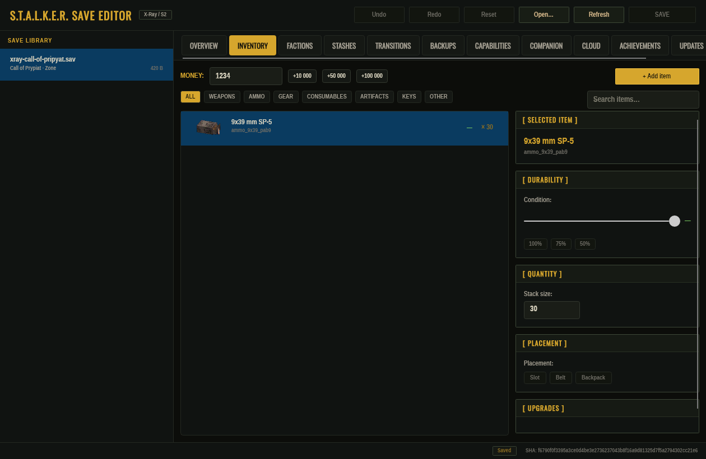

# S.T.A.L.K.E.R. Save Editor

[](https://github.com/Dmitriy-DE/S.T.A.L.K.E.R.-Save-Editor/actions/workflows/ci.yml)

Cross-platform **.NET 10** save editor (desktop and browser) and live in-game companion for the entire **S.T.A.L.K.E.R.** series:
- **S.T.A.L.K.E.R.: Shadow of Chernobyl** (1.0004 / 1.0006)
- **S.T.A.L.K.E.R.: Clear Sky** (1.5.10)
- **S.T.A.L.K.E.R.: Call of Pripyat** (1.6.02)
- **Enhanced Editions** (SoC, CS, CoP)
- **S.T.A.L.K.E.R. 2: Heart of Chornobyl** (UE5)



---

## What It Can Do

Every write goes through the same checked path: the change is prepared, the file is re-read and
verified, and a backup of the original is kept outside the save folder. Fields whose meaning is not
proven stay read-only; the **Capabilities** tab shows, per game, what can be written.

- **Library** — finds saves of all games (Steam, Proton, GOG, disc installs) and shows the game's own
  slot screenshot (S.T.A.L.K.E.R. 2: region and play time), newest first; «Open…» opens any file.
- **Overview** — money, actor name, health, rank, reputation, in-game date, item and stash counts; compare
  the save with another save of the same game or with one of its backups.
- **Inventory (X-Ray)** — money, stack counts, condition, slot/belt/backpack placement, weapon and armour
  upgrades, adding items from the catalogue and removing items. Item names and icons come from the
  installed game (mods such as OGSM included) or from the shipped pack.
- **Stashes, factions, level changers** — take loot out of stashes, change faction goodwill; level
  changers are listed, and the player can be moved to a known safe point of a level (X-Ray, with a backup).
- **S.T.A.L.K.E.R. 2** — reading, official item names and icons; writing stays off in the interface
  until changes are confirmed in the game.
- **Drafts** — edits are kept as a draft with undo/redo (`Ctrl+Z`, `Ctrl+Y`) and written with `Ctrl+S`.
- **Steam Cloud and achievements** — compare local and cloud saves, download, upload only after an
  explicit confirmation (never retried automatically); view and toggle achievements.
- **Companion mod** — installs into every SoC/CS/CoP found and gives an in-game menu (Esc → F1) with
  live cheats, teleport marks, weather and more; the app talks to it through a file protocol.
- **Game Doctor** — discovers Steam-manifest installs for all supported targets plus existing
  non-Steam trilogy locations, then checks the selected folder and build ID. It verifies per-file
  Companion and toolkit Game Fix ownership hashes, and labels other loose files unclassified rather
  than guessing they conflict. S.T.A.L.K.E.R. 2 custom mods can be moved out of Paks and restored by
  an explicit action.
- **Save Doctor** — structural parsing of a selected save plus quest checks from validated rules. A
  rule with a confirmed repair can be applied on request (a new file or a backed-up replacement);
  everything without a validated rule is reported as unknown, not guessed.
- **Game Fixes** — explicit catalogue, per-target/build gates, source and maturity details, and
  guarded install/remove actions and transactional Essential, Recommended and All safe presets
  through the shared atomic game-file layer. The number of fixes per game is shown in the app and by
  `fixes list`; no game-runtime result is claimed.
- **Crash Analyzer** — extracts X-Ray fatal fields, Lua errors, script file/line references and common
  engine exceptions from a selected log and discovers recent logs from supported installs. Unknown
  logs receive no fix recommendation.
- **Save Timeline and Encyclopedia** — orders discovered saves by real modification time and opens the
  existing adjacent compare; browses items from the installed game catalogue and uses the existing
  save-edit or Companion item-give actions when available.
- **Toolkit Environment** — content-addressed snapshots of provider-managed files, named Game Fix /
  Companion / config profiles, a bounded `user.ltx` editor, and a read-only install audit. Unknown or
  manifestless files remain untouched; vanilla status is limited to exact-build hashes already known
  to the fix catalogue, while all other loose files remain unknown.
- **Interface** — 15 languages, the games' own menu sounds and optional main-menu music, crash report
  and «Check environment» under Settings → Diagnostics.
- **Web edition** — the same interface in the browser (WebAssembly) at
  [stalker-save-editor.pages.dev](https://stalker-save-editor.pages.dev); files never leave the browser.
- **S.T.A.L.K.E.R. 2 companion (experimental)** — a UE4SS mod, installed only on request; it logs
  everything it does so problems can be fixed.

### Reports

To find bugs, the desktop editor sends its log to the developer once a day and right after a crash
(the S.T.A.L.K.E.R. 2 mod's log is included). Paths, user names and Steam IDs are removed; saves are
never sent. Nothing is sent until you have seen the notice on the first start, and it can be switched
off there or in Settings → Diagnostics.

## How to Install & Run

### Download Pre-Built Releases

Download the latest release package for your operating system from [Releases](https://github.com/Dmitriy-DE/S.T.A.L.K.E.R.-Save-Editor/releases):

| Platform | Download | How to install |
|---|---|---|
| **Windows** | [Setup](https://github.com/Dmitriy-DE/S.T.A.L.K.E.R.-Save-Editor/releases/latest/download/SaveEditor-windows-x86_64-setup.exe) | Run it. Components include the editor, command-line tool, and companion mod. Game Fixes are optional; Setup can apply a selected safe preset through the CLI to compatible installations. |
| **Windows** | [Portable zip](https://github.com/Dmitriy-DE/S.T.A.L.K.E.R.-Save-Editor/releases/latest/download/SaveEditor-windows-x86_64.zip) | Unpack anywhere and run `StalkerSaveEditor.exe`. |
| **Linux** | [.deb](https://github.com/Dmitriy-DE/S.T.A.L.K.E.R.-Save-Editor/releases/latest/download/stalker-save-editor_amd64.deb) | `sudo apt install ./stalker-save-editor_amd64.deb` — commands `stalker-save-editor` and `stalker-save-editor-cli`. |
| **Linux** | AppImage (on the [release page](https://github.com/Dmitriy-DE/S.T.A.L.K.E.R.-Save-Editor/releases/latest)) | `chmod +x` and run. |
| **Linux** | [tar.gz](https://github.com/Dmitriy-DE/S.T.A.L.K.E.R.-Save-Editor/releases/latest/download/SaveEditor-linux-x86_64.tar.gz) | Unpack and run `./StalkerSaveEditor`. |
| **macOS** | [Apple Silicon](https://github.com/Dmitriy-DE/S.T.A.L.K.E.R.-Save-Editor/releases/latest/download/SaveEditor-macos-arm64.dmg) · [Intel](https://github.com/Dmitriy-DE/S.T.A.L.K.E.R.-Save-Editor/releases/latest/download/SaveEditor-macos-x86_64.dmg) | Open and drag `StalkerSaveEditor.app` to Applications (not notarized: right-click → Open the first time). |
| **Browser** | [stalker-save-editor.pages.dev](https://stalker-save-editor.pages.dev) | Nothing to install; Steam, cloud and the companion are desktop-only. |

The app checks for updates itself (Updates tab) and installs them after you confirm.

Every package contains the companion mod; the app (Companion → «Все игры»), the Windows installer
and `stalker-save-editor-cli companion install all` put it into the games. The mod also patches a few
game scripts, so it is not offered as a plain archive.

#### Windows SmartScreen

The Windows builds are not code-signed, so SmartScreen may say *"Windows protected your PC"* the
first time. Click **More info → Run anyway**. Check the file first if you like: its SHA-256 is listed
in `SHA256SUMS` next to the download (`Get-FileHash .\SaveEditor-windows-x86_64-setup.exe`).

---

### Building from Source

#### Prerequisites
- [.NET 10.0 SDK](https://dotnet.microsoft.com/)
- Python 3.10+ (for helper tools and codecs)
- Lua 5.1 (`luac5.1` or `luac`) for companion verification

#### Build Solution
```bash
# Clone repository
git clone https://github.com/Dmitriy-DE/S.T.A.L.K.E.R.-Save-Editor.git
cd S.T.A.L.K.E.R.-Save-Editor

# Build release configuration
dotnet build --configuration Release -warnaserror
```

#### Run Tests & Checks
```bash
# Execute unit and ViewModel test suite
dotnet test

# Validate companion mod Lua scripts and binder patch syntax
./tools/check_companion.sh

# Inspect a selected game install, save, or crash log
stalker-save-editor-cli doctor discover --json
stalker-save-editor-cli doctor game cs "/path/to/Clear Sky"
stalker-save-editor-cli doctor save "/path/to/save.sav" --json
stalker-save-editor-cli crash analyse "/path/to/xray.log" --json
stalker-save-editor-cli crash discover --json
stalker-save-editor-cli doctor quest "/path/to/save.sav" --json
stalker-save-editor-cli doctor quest-repair "/path/to/save.sav"
stalker-save-editor-cli fixes list --json
stalker-save-editor-cli fixes apply-preset recommended cs "/path/to/Clear Sky" --json

# Verify i18n coverage across all locales
dotnet run --project src/StalkerSaveEditor.App -- --test-i18n

# Verify audio sound asset integrity
dotnet run --project src/StalkerSaveEditor.App -- --test-audio
```

#### Launch the Desktop Editor
```bash
dotnet run --project src/StalkerSaveEditor.App
```

---

## Verification Levels & Reliability (L1–L5)

In accordance with our [Reliability Charter](docs/roadmap/RL-reliability.md), every feature is categorized by its verified confidence level:

- **L1 (Synthetic Round-Trip)**: Bit-level serializer/parser round-trips and checksum verification on synthetic fixtures.
- **L2 (Synthetic UI Headless & Test Suite)**: ViewModel unit tests, Avalonia headless UI rendering, Lua 5.1 syntax checks, and complete i18n audits.
- **L3 (Standalone Application & Packaging)**: Validated execution of compiled native bundles (`.AppImage`, `.deb`, `.exe`, `.dmg`) with bundled assets.
- **L4 (Game-Accepted Output)**: Save mutations loaded and saved without error in retail game engines.
- **L5 (Steam Cloud & Production Certified)**: End-to-end verified with retail Steam Cloud and retail games.

---

## Documentation Links

- [Project Roadmap & State](docs/roadmap/STATE.md)
- [Reliability & Verification Levels (L1–L5)](docs/roadmap/RL-reliability.md)
- [In-Game Companion Mod & Protocol Guide](docs/COMPANION.md)
- [Companion Protocol Specification (v1)](docs/MOD_COMPANION_PROTOCOL.md)
- [Cross-Platform Packaging & Distribution Guide](docs/PACKAGING.md)
- [Architecture Guidelines](ARCHITECTURE.md)
- [Installed-game patching architecture](docs/PATCHING_ARCHITECTURE.md)
- [Game Fix catalogue and safety model](docs/GAME_FIXES.md)
- [Game Fix research ledger](docs/GAME_FIX_RESEARCH.md)
- [Game / Save Doctor and Crash Analyzer](docs/GAME_DOCTOR.md)
- [Profiles, snapshots and rollback status](docs/PROFILES.md)
- [Safety Rules & Agent Guidelines](AGENTS.md)
