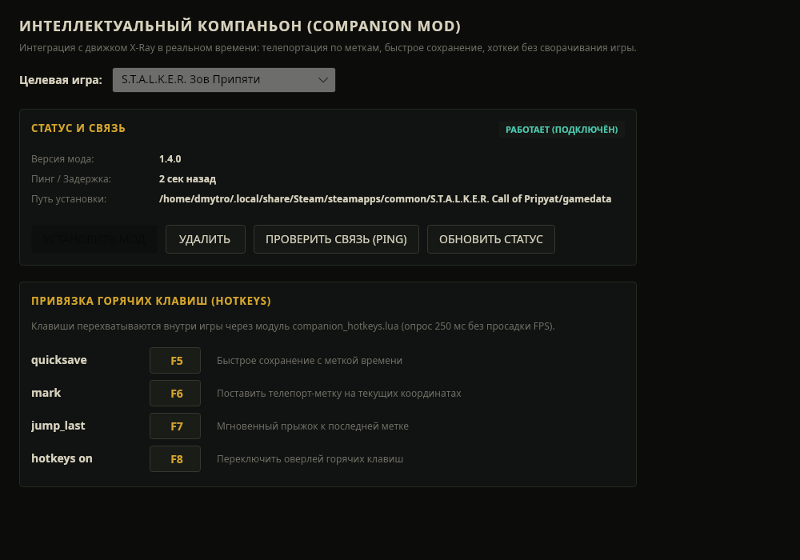

# In-Game Companion Mod & Protocol Guide

The S.T.A.L.K.E.R. Save Editor Companion provides a live bridge between the desktop editor and running X-Ray engine games without requiring the player to exit or reload their save.



---

## 1. Architecture & Communication Protocol

The companion uses an atomic, non-blocking file exchange inside the game's `$app_data_root$` directory (the same folder where `savedgames/` and `user.ltx` reside).

```
Desktop Editor                           Game (X-Ray Engine)
      |                                           |
      |-- 1. Writes save_editor_cmd.tmp --------->|
      |-- 2. Atomically renames to .txt --------->|
      |                                           | (Polled every 250 ms in actor_binder)
      |                                           |-- 3. Reads & deletes command file
      |                                           |-- 4. Executes Lua engine call
      |                                           |-- 5. Writes save_editor_out.tmp
      |                                           |-- 6. Atomically renames to .txt
      |<-- 7. Editor reads reply -----------------|
```

### Protocol Format (v1)

- **Command format**: `v1 <id> <command> [args...]`
- **Reply format**: `v1 <id> <status> <text>`
  - `status`: `ok`, `error`, or `unsupported`

---

## 2. Supported Commands

| Command | Arguments | Description | Response Example |
|---|---|---|---|
| `ping` | — | Checks live mod responsiveness | `pong` |
| `info` | — | Queries player coordinates, current level, and balance | `level=zaton x=12.4 y=0.5 z=-85.2 money=5000` |
| `give` | `<section> [count]` | Spawns item(s) into actor inventory (1–100) | `gave 5 medkit` |
| `money` | `<delta>` | Adjusts player money (refuses negative balances) | `money=15000` |
| `heal` | — | Restores full health, stamina, psy-health, clears radiation | `healed` |
| `repair_equipped` | — | Restores all equipped weapons and armor to 100% condition | `repaired=3` |
| `teleport` | `<x> <y> <z>` | Teleports actor within the current level | `at 12.4 0.5 -85.2` |
| `list_inventory` | — | Lists all items in actor inventory with engine IDs | `medkit:1234,wpn_ak74:1235` |
| `weather` | `[<section>] [now]` | Queries or sets active weather cycle | `weather=clear` |
| `mark` | `[<text>]` | Saves current player position as a named map marker | `marked <name>` |
| `jump_last` | — | Teleports player back to the most recent marker or position | `jumped` |
| `quicksave` | `[<name>]` | Triggers an immediate engine save | `saved` |
| `hotkeys on` | — | Activates in-game keybindings listener | `hotkeys active` |

---

## 3. Game Engine Support

| Game | Compatibility | Notes |
|---|---|---|
| **Shadow of Chernobyl** (1.0004 / 1.0006) | Full parity | Time acceleration fallback without `change_game_time`. Safe corpse removal guarding story NPCs. |
| **Clear Sky** (1.5.10) | Full parity | Surge suppression integration via `xr_surge_hide`. Safe squad spawning across faction camps. |
| **Call of Pripyat** (1.6.02) | Full parity | Native `change_game_time`, surge manager integration, live UI window (`CUIScriptWnd`). |
| **Enhanced Edition** (SoC / CS / CoP) | Full parity | Packaging for Workshop / mod.io as `.xrp` packages. |
| **S.T.A.L.K.E.R. 2: Heart of Chornobyl** | Prototype | UE5 Lua script companion (`mods/companion/s2/SaveEditorCompanion/Scripts/main.lua`). |

---

## 4. Installation & Hook Mechanics

Vanilla X-Ray engines do not feature an automatic script mod loader. The companion hooks into the game loop through `bind_stalker.script`.

### Hook Insertion

In `gamedata/scripts/bind_stalker.script`, inside `actor_binder:update(delta)` right after `object_binder.update(self, delta)`:

```lua
if save_editor_companion then save_editor_companion.update() end
```

And inside `actor_binder:use_inventory_item(obj)`:

```lua
if save_editor_companion and save_editor_companion.on_item_use then
    save_editor_companion.on_item_use(obj)
end
```

The Desktop Save Editor features a one-click **Install Hooks** / **Uninstall Hooks** manager on the Companion screen that automatically extracts the script from game archives if missing, applies the hooks cleanly, and preserves an untouched `.bak` backup.

---

## 5. Desktop Companion Dashboard

The desktop application provides a dedicated **Companion** tab featuring:

1. **Connection Status**: Real-time polling indicator, latency measurement, and protocol version detection.
2. **Hook Management**: Game path selection, installation verification, and clean rollback.
3. **In-Game Hotkey Manager**:
   - Menu Toggle (`F1` default)
   - Jump to Last Bookmark (`F2` default)
   - Immediate Quicksave (`F5` default)
   - Emergency Full Heal (`F9` default)
4. **Live Actions**: Instant heal, repair gear, add roubles, and jump to level locations directly from the desktop UI.

---

## 6. Testing & CI Verification

Companion scripts and hook syntax are verified automatically via `tools/check_companion.sh`:
- Lua 5.1 syntax compilation (`luac5.1 -p`) on all 18 companion script files.
- Syntax validation of `bind_stalker.script` hook lines and complete synthetic binder script.
- UI contract validation via `tools/check_companion_ui.py`.
- Automated GitHub Actions job configured in `.github/workflows/companion-check.yml`.
